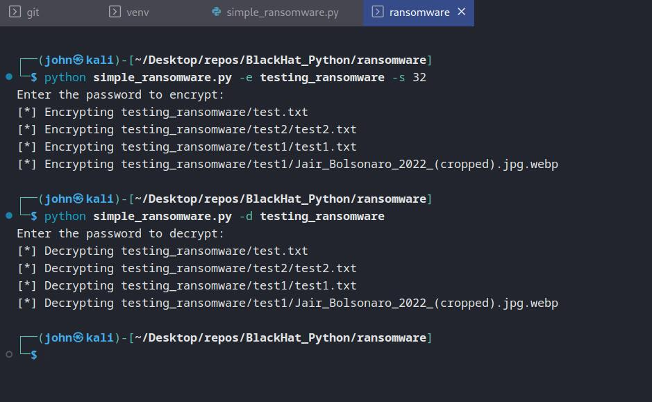
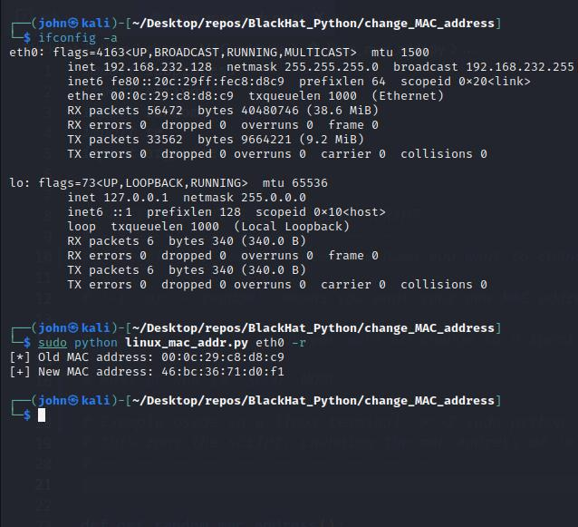
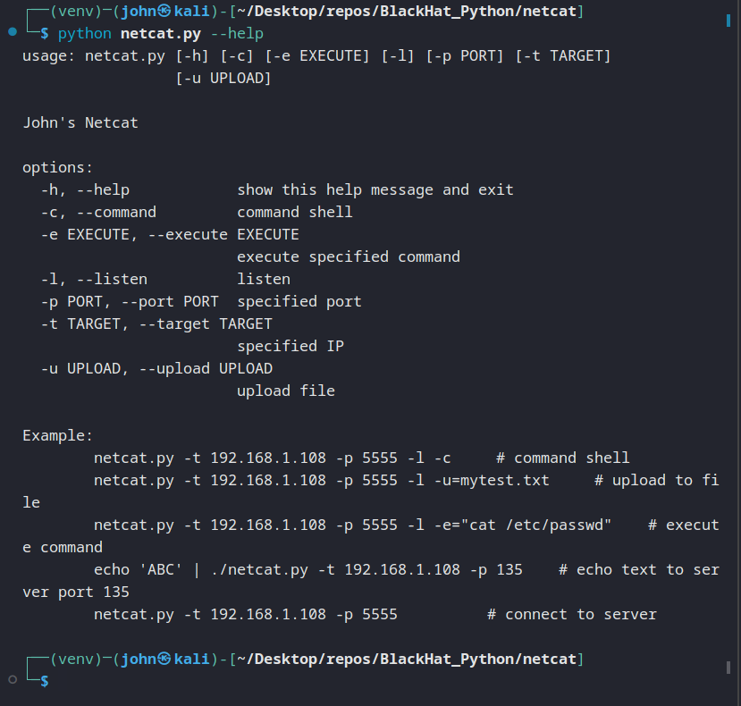

# Hacking with Python and Kali Linux


  


<br/>
## Contents
- [Overview](#overview)
- [Setup](#setup)
- [Usage](#usage)
- [Screenshots](#screenshots)
- [Contribution](#contribution)
- [License](#license)
- [Contact](#contact)

## Overview
[](https://opensource.org/licenses/MIT)

I've been using Python for a while, but now I'm learning how to use it for pen testing and hacking. Each folder in this repo is a separate project (don't try to run this entire repo at once). Some scripts require a Kali VM, others are meant to run on Windows or any Linux OS. Some also require an external wireless adapter (like [Denial_of_Service_WLAN/](./Denial_of_Service_WLAN/)).

## Setup

Most of these projects require [Kali Linux](https://www.kali.org/) running inside a virtual machine. You'll also need a hypervisor virtualization client (like [VMware](https://www.vmware.com/), [VirtualBox](https://www.virtualbox.org/) or [Hyper-V](https://learn.microsoft.com/en-us/virtualization/hyper-v-on-windows/about/)).
<br />
On my computer (Windows 11 x64, v10.0.2) I followed these steps to setup the VM and Kali Linux:


- Make sure Virtualization is ENABLED in your system BIOS/UEFI.

- Turn on "Windows Hypervisor Platform" in "Turn Windows Features on or off"

- Download "VMware Workstation 17.0.2 Player" [(this version is FREE)](https://customerconnect.vmware.com/en/downloads/details?downloadGroup=WKST-PLAYER-1702&productId=1377&rPId=104734)

- Download [Kali Linux ISO](https://www.kali.org/get-kali/#kali-installer-images)

- Follow these steps to create the VM: [Kali VMware Docs](https://www.kali.org/docs/virtualization/install-vmware-guest-vm/)

- Follow these steps (inside the VM) to complete Setup: [Kali Setup](https://www.kali.org/docs/Setup/hard-disk-install/)

- Now you should have a virtual machine with Kali Linux installed!

- Next open a terminal in your Kali VM and run these commands to install and update the packages:

```
sudo apt update
apt list --upgradable
sudo apt upgrade
sudo apt dist-upgrade
sudo apt autoremove
```

- Check which Python version is installed:
```
python3
```

- You need Python version 3.7 or higher. If you need to upgrade your version, run this command:

```
sudo apt-get upgrade python3
```
- Then install the Python package for virtual environments:
```
sudo apt-get install python3-venv
```

- Install an IDE of your choice (I prefer VSCode):
    - first download the [VSCode .deb package](https://go.microsoft.com/fwlink/?LinkID=760868) (64-bit) and replace `<file>` in the first command below with the path of the .deb package:

```
sudo apt install ./<file>.deb
sudo apt install apt-transport-https
sudo apt update
sudo apt install code
```

- Open VSCode:
```
code .
```

- Make a new directory to work in and create a virtual environment:
    (at this point I usually open a terminal inside VSCode, so I don't have so many windows)
```
mkdir mynewfolder
cd mynewfolder
python3 -m venv venv
source venv/bin/activate
python
```

## Usage
Usage instructions are at the beginning of each script. Some scripts may need to be modified before running, depending on what you're trying to do.

## Screenshots

### Basic Ransomware:


### Change MAC address on a Linux machine:


<br />

### John's Netcat:


<br />

## Contribution
Contribute by forking the [repo](https://github.com/jroller33/blackhat_python) and submitting a pull request!

## License
This project is licensed under the [MIT License](https://github.com/jroller33/blackhat_python). <br/>


## Contact
[GitHub](https://github.com/jroller33)

